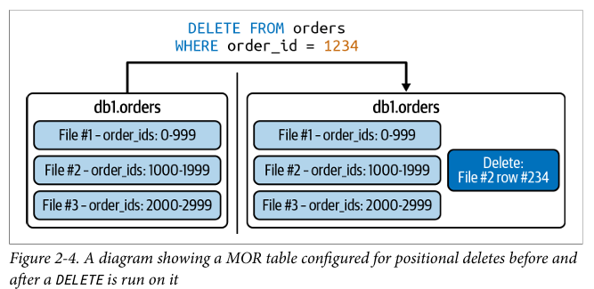
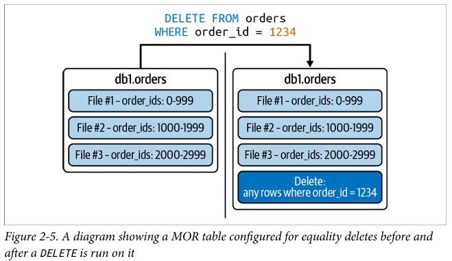
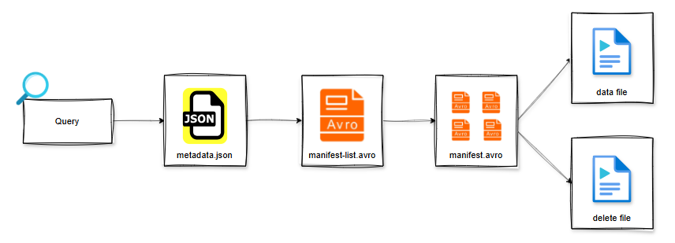

## Định nghĩa
Cung cấp layer quản lý metadata cho dữ liệu trong Data Lake
Cho phép sử dụng Data Lake như một Data Warehouse nhờ các tính năng:
- ACID transaction
- Schema evolution (Thêm cột, đổi thứ tự)
- Update / Delete / Merge
- Time travel (Back lại snapshot)

Đặc biến tương thích nhiều datalake và SQL engine


## Table Format lí do ice berg ra đời
- Giai đoạn 1: RDBMS chỉ scale dọc
- Giai đoạn 2: Hadoop scale ngang nhưng còn nhiều khuyết điểm (Ko thân thiện (map reduce java code), full scan, quản lý table theo directory, folder, subfolder, mỗi execution sẽ ghi ra file luôn)
- Giai đoạn 3: Hive + Hadoop (SQL code thân thiện hơn nhưng vẫn chưa giải quyết được vấn đề tối ưu và table format)
- Giai đoạn 4: Spark ra đời giải quyết được vấn đề tối ưu plan, mạnh trong xử lý song nhưng vẫn chưa giải quyết được table format.
- Giai đoạn 5: Hudi, Delta Lake, Apache Ice Berg đã đổi cơ chế quản lý table từ directory sang file bằng cách tối ưu metadata. 
    - Tối ưu trải nghiệm người dùng như chỉ thấy snapshot trước sau vì track file theo metadata
    - Ko bị fullscan vì biết được file nào cần thông metadata
    - Người dùng ko cần nhớ tên subfolder của partition để truy vấn nữa.


## Partition của Ice Berg
Hiệu quả hơn Spark nếu partition theo thời gian vì:
- Nếu user hồn nhiên ko đọc tổ chức partition và query select * from table where order > 1-2-2022 08:00:00
- Mà partition column theo ngày. Thì spark thấy ko có khớp với điều kiện where
- Lúc này spark, bắt buộc phải full scan.
=> Hidden Partition của Ice Berg hiệu quả vì nó đọc metadata hiểu được các partition và thông số min max nữa => **GOOD**


## 2 cơ chế xử lý dữ liệu trong bảng
Ở compute engine truyền thống mặc định khi thêm, xóa, sửa data => tạo 1 file mới
- Nhưng Ice Berg có 2 cách:
    - Cách 1: Copy on write như truyền thống (Batching)
    - Cách 2: Merge On Read. Nó xóa dòng data bỏ. Tạo thêm 1 file chứa data mới (chỉ data mới). Manifest file ghi nhận mqh của các file. => ghi nhanh, đọc chậm phù streaming (Streaming muốn show)

Tại sao nói COW hay MOR hợp với từng loại streaming/batching
- Với batching cần đọc data thường xuyên nên yêu cầu write cho chuẩn sau này đọc cho tiện
- Với streaming muốn hạn chế ngắt quảng nên yêu write nhanh liên tục


## Positional Delete File vs Equality Delete File 
- Delete file xuất hiện khi dùng MOR
- Cách 1: Positional Delete File sẽ chứa thông tin file và thứ tự dòng bị xóa. zero-based index: đếm từ 0 tới n-1
VD: row #234 nghĩa là dòng 235


- Cách 2: Equality Delete File sẽ lưu row bị xóa dựa vào giá trị cụ thể.



## Cơ chế lưu trữ và thành phần của ice berg
- Tương tự Delta Lake
- Khi drop table nó chỉ chỉnh sửa metadata ko xóa data file mà giấu khỏi người dùng thôi.
- Khi một thao tác append / delete / overwrite / alter được commit thành công -> Iceberg tạo snapshot mới
- Gồm 3 file: 
    - json: chứa thông tin về snapshot hiện tại gồm schema, id snapshot, thông tin partition,...
    - 1 file Avro Snap (Manifest list): Chứa danh sách các manifest file
    - 1 file Avro (Manifest): Chứa tất tần thông tin các datafile thuộc về snapshot đó.
    


## Hidden Partition vs Partition
Partition bình thường sẽ chia dữ liệu theo các ngăn kéo trong kho. Khi đổi phương thức lưu trữ (Từ ngăn kéo theo ngày thành ngăn theo tháng) sẽ phải lôi  hết hồ sơ ra sắp vô tủ tháng => REWRITE

Hidden Partition quản lý hồ sơ bằng metadata nếu đổi cách lưu viết lại sổ mới ko phải sắp xếp nữa => ko bị REWRITE


## Data Compaction
Gom file nhỏ thành file lớn

## Catalog
Catalog là nơi quản lý metadata (cuốn sổ ghi lại cách tổ chức file)
Nó lưu
- Table có tồn tại ko?
- Table nằm ở đâu

```sql
SELECT *
FROM my_catalog.iceberg_book.orders.metadata_log_entries
ORDER BY timestamp DESC
LIMIT 1

SELECT *
FROM demo.db.orders.metadata_log_entries
ORDER BY timestamp DESC
LIMIT 1;
```
Metadata file hiện tại của table là file nào?
Kết quả trả về: s3://.../metadata/00002-....metadata.json


## Puffin file
Puffin file là metadata nâng cao, lưu các thống kê và index nhẹ ở mức data file, giúp query engine quyết định bỏ qua những file không thỏa điều kiện (file pruning).
VD: Có bao nhiêu cuốn sách
    - Ko puffin: Mở metadata -> manifest list -> manifest files -> data file -> Count Distinct
    - Có puffin: Đọc tờ ghi chú (puffin)
        → bỏ qua các file không liên quan
        → chỉ đọc những file cần thiết
