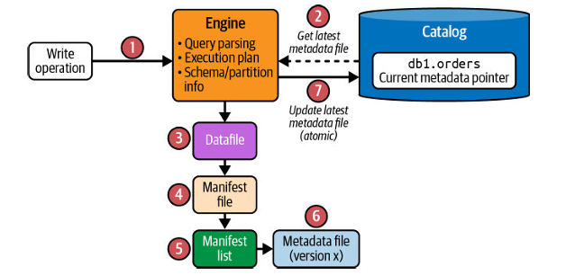
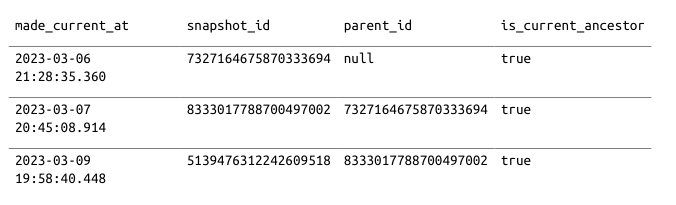

# LIFECYCLE WRITING & READING IN ICE BERG
## I. Quy trình ghi file
1. User gửi query (INSERT / MERGE / UPDATE…) vào query engine → engine parse và lập kế hoạch ghi.

2. Engine tương tác với catalog
→ lấy metadata hiện tại của table
→ biết schema và partition spec đang được dùng.

3. Engine ghi data files
→ ghi các datafile mới xuống file storage system (S3 / HDFS / MinIO…).

4. Engine tạo metadata mới cho lần ghi
- Tạo manifest file mới (mô tả các datafile vừa ghi)
- Tạo manifest list mới (trỏ tới các manifest file hợp lệ)
- Tạo metadata file mới (đại diện cho version mới của table)

5. Cập nhật catalog
→ catalog được update để trỏ sang metadata file mới


## II. CREATE TABLE

```sql
CREATE TABLE demo.db.orders (
order_id BIGINT,
customer_id BIGINT,
order_amount DECIMAL(10, 2),
order_ts TIMESTAMP
) 
USING iceberg
PARTITIONED BY (HOUR(order_ts));
```

## III. Check catalog
```sql
SELECT *
FROM demo.db.orders.metadata_log_entries
ORDER BY timestamp DESC
LIMIT 1;
```

## IV. Insert query
```sql
INSERT INTO demo.db.orders VALUES (
   123,
   456,
   36.17,
   cast('2023-03-07 08:10:23' as timestamp)
);
```

## V. Merge query
Cơ chế lấy data bảng A đổ vào bảng B, if trùng PK update else insert
```sql
MERGE INTO orders o
USING (SELECT * FROM orders_staging) s
ON o.order_id = s.order_id
WHEN MATCHED THEN UPDATE SET order_amount = s.order_amount
WHEN NOT MATCHED THEN INSERT *;
```

## VI. The Time-Travel Query
Apache Iceberg provides 2 ways: using a timestamp and using a snapshot ID.

#### Xem lịch sử
Lưu ý: Tạo table ko tạo snapshot mới (trong sách thì có, nhưng version hiện tại test ko có)
```sql
SELECT * FROM catalog.db.orders.history;
```



#### TIMESTAMP
```sql
SELECT * FROM orders 
TIMESTAMP AS OF '2026-02-02 06:35:26.1';
```

#### SNAPSHOT ID
```sql
SELECT *
FROM orders
VERSION AS OF 3288535526291832090;
```