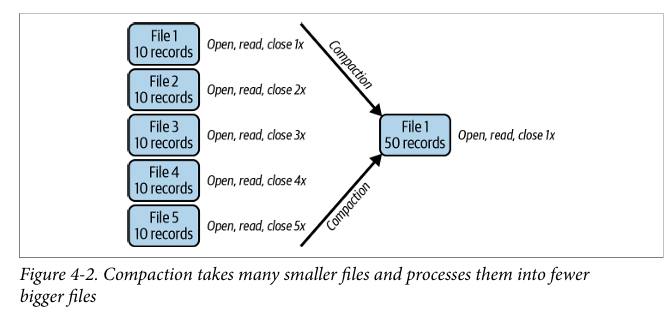
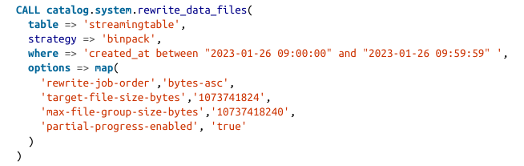
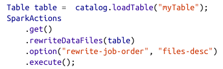
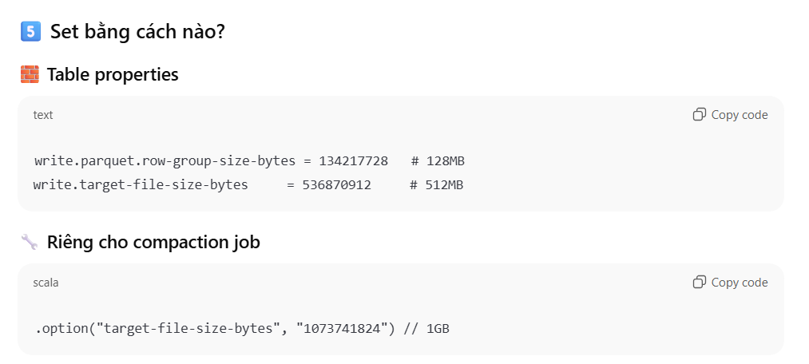

# Optimizing the Performance
## I. Compaction
Gom các data files nhỏ về 1 file lớn để giảm thiểu thao tác đọc, mở, đóng.


**Quick Note for Streaming Tasks:**
- Áp dụng compaction trong khung 1 giờ. 
- Áp dụng strategy binpack.
- Target file size ~ 1GB
- Bật partial progress commit
- Có thể kết hợp airflow để auto compaction



## II. Demo code
```spark
Table table =  catalog.loadTable("myTable");
SparkActions
.get()
.rewriteDataFiles(table)
.option("rewrite-job-order", "files-desc")
.execute();
```



## III. Các phương thức
### Strategies (Methods)

| Method  | Mô tả |
|--------|------|
| sort   | Rewrite data files và **sort theo một hoặc nhiều cột** theo thứ tự ưu tiên |
| zOrder | Rewrite data files và **Z-order sort** theo nhiều cột với **trọng số ngang nhau** |
| filter | Chỉ rewrite **những file thỏa điều kiện** (expression) |
| option | Set **một option đơn lẻ** |
| options| Set **nhiều option cùng lúc** (map) |

- strategy => 'binpack': gom files nhỏ thành file bự => Rất nhanh chóng
- Nhưng nếu dùng 'sort/z-Order' nó sẽ compact theo thứ tự 1/n cột nào đó => sau query nhanh hơn vì cùng giá trị nằm hết ở 1 file, nhưng thời gian gom khá lâu.
- Sort: sắp cột A theo thứ tự, B sắp theo thứ tự, C, D,...
- Z-Order: Sắp cột Z-order sẽ nhóm:

(1,1),(1,2),(2,1),(2,2)

rồi tới (1,3),(2,3)...

| Các loại compaction | Cách thức | Ưu điểm | Nhược điểm |
|---------------------|-----------|---------|------------|
| binpack | Gom các file nhỏ thuần | Nhanh gọn lẹ => hợp streaming | Ko tối ưu cho heavy query |
| Sort | Sort từng cột từng cột, rồi mới gom file | Phù hợp cho heavy query 1 cột | Quá trình gom mất thời gian |
| Z-Order | Sort zigzag | Cực phù hợp cho heavy query nhiều cột | Quá trình gom mất thời gian hơn cả Sort |

Z-Order sẽ sort như sau: (1,1), (1,2), (2,1), (2,2), rồi mới tới (1,3), (2,3),...


---

### Options
| Option | Ý nghĩa |
|------|--------|
| target-file-size-bytes | Kích thước file output mong muốn (default: **512MB**, lấy từ `write.target.file-size-bytes`) |
| max-concurrent-file-group-rewrites | Số **file group tối đa** được rewrite **song song** |
| max-file-group-size-bytes | Giới hạn size của **một file group** để tránh vượt memory của worker |
| partial-progress-enabled | Cho phép **commit từng phần** trong khi compaction vẫn đang chạy |
| partial-progress-max-commits | Số **commit tối đa** khi bật partial progress |
| rewrite-job-order | Thứ tự rewrite file groups: `bytes-asc`, `bytes-desc`, `files-asc`, `files-desc`, `none` |

---

### rewrite-job-order Values
| Value | Ý nghĩa |
|-----|--------|
| bytes-asc | Rewrite group nhỏ trước |
| bytes-desc | Rewrite group lớn trước |
| files-asc | Group ít file trước |
| files-desc | Group nhiều file trước |
| none | Không ưu tiên |


## IV. File Size & Row Group Size
**Filter query nhiều ưu tiên chia nhiều group, full scan nhiều chia ít group**

### 1. Parquet
Đối với Parquet có row group size & file size:
- **Row group**: đơn vị đọc nhỏ nhất, có metadata riêng. 
- Query Engine skip theo **row group** ko phải theo row.

Set up default:
- 4 row groups/file
- Row group: 128MB
- File size: 512MB

**Lưu ý:** Nên chia đều giữa file size và row group để tránh file cuối nhỏ hơn.

### 2. So sánh row groups
| Chiến lược                             | Ưu điểm                                                | Nhược điểm                                                             |
| -------------------------------------- | ------------------------------------------------------ | ---------------------------------------------------------------------- |
| **Ít row group**<br> | - File gọn hơn<br>- Ít metadata hơn<br>- Overhead thấp | - Predicate pushdown kém<br>- Query filter phải đọc nhiều dữ liệu thừa |
| **Nhiều row group**<br> | - Predicate pushdown tốt<br>- Query filter nhanh hơn   | - Metadata nhiều hơn<br>- Tốn thời gian đọc metadata                   |


**Ví dụ:**
- File 1 GB chia làm 8 row group hoặc 4 row group
- Khi lọc cột country tìm 'VN'
- Nếu ít row group đỡ tốn tgian đọc nhiều metadata hơn
- Nhưng nhiều row đọc min/max ở metadata đã có thể lọc kha khá row group

### 3. Setting parameters



## V. Partial Progress
Compact được nhiêu files nhỏ (file group) commit, tạo snapshot mới luôn tránh out-of-mem và đảm bảo lastest version được user sử dụng

from III:
| Option | Ý nghĩa |
|-----|--------|
| partial-progress-enabled | Cho phép **commit từng phần** trong khi compaction vẫn đang chạy |
| partial-progress-max-commits | Số **commit tối đa** khi bật partial progress |


## VI. Code Example
có 2 loại:
- Actions API (Java/Scala)
- Spark SQL

---

```sql
Table table = catalog.loadTable("myTable");
SparkActions
    .get()
    .rewriteDataFiles(table)
    .sort()
    .filter(Expressions.and(
    Expressions.greaterThanOrEqual("date", "2023-01-01"),
    Expressions.lessThanOrEqual("date", "2023-01-31")))
    .option("rewrite-job-order", "files-desc")
    .execute();
```

- rewriteDataFiles  : chạy compaction (gộp datafile)
- sort()            : sort theo sort order của table (row-level)
- filter            : giới hạn datafile cần rewrite (trong manifest file có trường partition)
- rewrite-job-order : ưu tiên group nhiều file rewrite trước
- execute           : trigger Spark job + commit snapshot


---

```sql
CALL catalog.system.rewrite_data_files(
    table => 'musicians',
    strategy => 'binpack',
    where => 'genre = "rock"',
    options => map(
    'rewrite-job-order','bytes-asc',
    'target-file-size-bytes','1073741824', -- 1GB
    'max-file-group-size-bytes','10737418240' -- 10GB
    )
)
```
- rewriteDataFiles                  : chạy compaction (gộp datafile)
- Binpack                           : chiến lược mặc định (ko sort)
- where = filter                    : xét trường partition trong mainifest file
- rewrite-job-order +  bytes-asc    : ưu tiên group nhiều file rewrite trước
- target-file-size-byte             : file bự sau khi được gộp có kích thước  
- max-file-group-size-bytes         : group file max kích thước 


## VII. 